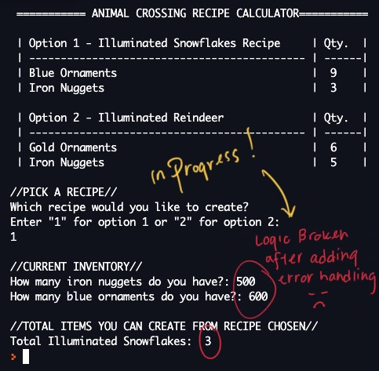
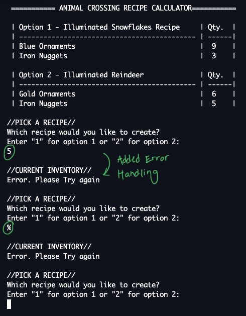

# Project - Animal Crossing Recipe Calculator (Status: In Progress)
**Author:**     Jessica Cassidy\
**Date:**       December 6, 2020

## Status (Last Updated - 12/23/20): 
Project not finished. Need to fix the logic and thinking about adding in a Python GUI like Tkinter. Added some error handling recently. When user enters invalid data, then program re-prompts user to enter data again. After error handling was added, the logic broke. 

## Description: 
The recipe calculator gives two recipe options from Animal Crossing New Horizons. The user picks from two recipes available. After the user selected an option, the user is then prompted to provide their current inventory of each item applicable to the recipe, then the program calculates the total items they can create from that recipe.

| Option 1 - Illuminated Snowflakes Recipe     | Qty.  |
| -------------------------------------------- | ------|
| Blue Ornaments                               |  9    |
| Iron Nuggets                                 |  3    |

| Option 2 - Illuminated Reindeer              | Qty.  |
| -------------------------------------------- | ------|
| Gold Ornaments                               |  6    |
| Iron Nuggets                                 |  5    |

**Input:**      
- Pick a recipe from options 1 & 2
- Enter inventory qty. of items req. for recipe

**Output:**     
Total times you can execute/create an item based on that recipe.

## Program Output Example:

