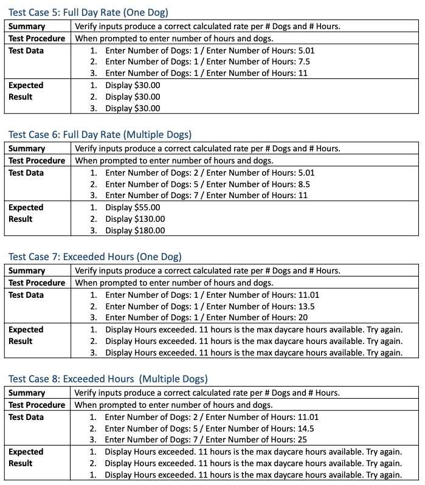

# Project - Doggy Daycare Calculator
**Author:**     Jessica Cassidy\
**Date:**       December 5, 2020

## Description: 
The Doggy Daycare Calculator calculates the number of dogs and hours entered by a user. The hours correspond to the Hours Rate Type: hourly, half day, and full day rates.\
(See JavaScript Version: https://github.com/cassjsdev/javascript_projects/edit/master/doggy_daycare_calculator/README.md)

| Length                                       | Rate           | Additional Dog |  
| -------------------------------------------- | ---------------| ---------------|
| Hourly (Max 2 hours)                         | $ 7.00/Hr      | N/A            |
| Half Day (Over 2 hrs - up to 5 hours max)    | $ 20.00        | $ 15.00        |
| Full Day (Over 5 hours - up to 11 hours max) | $ 30.00        | $ 25.00        |

**Input:**      
- numDogs = int(input('Enter Number of Dogs: ')) 
- numHours = float(input('Enter Number of Hours: '))

**Output:**     
Displays the total calculated rate based on the number of dogs and number of hours entered by user.\
Calculated Rate in USD $0.00

## Pseudocode:

## Sample Program:
Enter Number of Dogs:\
Enter Number of Hours:

## Program Output Example:

## Test Plan Overview:
System tests using black-box testing of all functions of the program. Valid and invalid inputs are tested.

### Test Cases:

