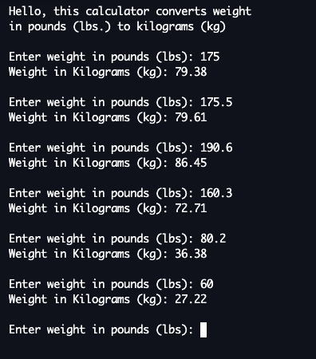

# Project - Pounds(lbs) to Kilograms(kg) Converter
**Author:**     Jessica Cassidy\
**Date:**       October 4, 2020

## Description: 
This program prompts user to enter a weight in pounds(lbs) and converts it to Kilograms(kg). The user input to enter weight in pounds gets reprompted infinitely after each conversion to kilograms(kg).

**Input:**      Weight in Pounds(lbs)\
**Output:**     Weight in Kilograms(kg)

## Sample Program:
Hello, this calculator converts weight in pounds (lbs.) to kilograms (kg).

Enter weight in pounds(lbs):\
Weight in Kilograms(kg):

## Pseudocode:
- Declare Real currentWeightlbs as 0.00
- Declare Real kilosPerlb as 0.453592
- Display "Hello, this calculator converts weight in pounds(lbs) to kilograms(kg)."
- While True:
  - Input "Enter weight in pounds (lbs): "
  - Input float currentWeightlbs
  - Set convertKilos = currentWeightlbs * kilosPerlb
  - Display "Weight in Kilograms (kg): 0.00"

## Program Output Example:
